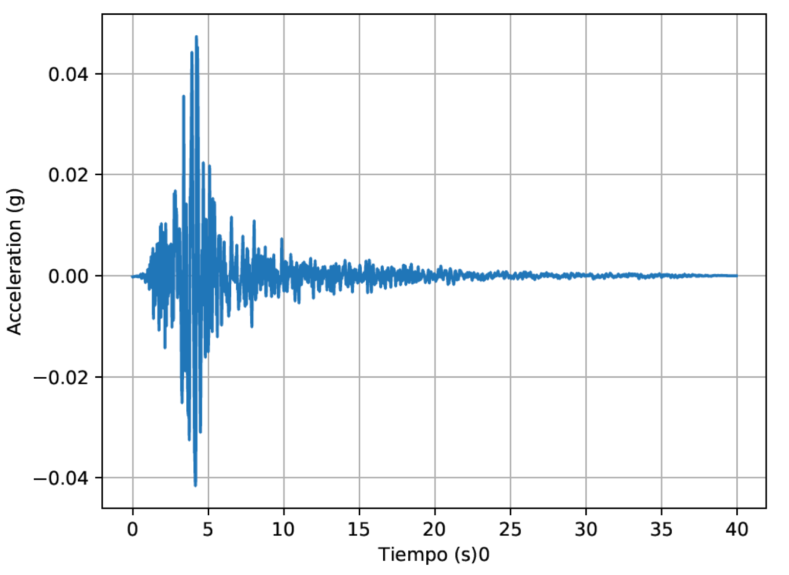

# Processing of time series

This _repo_ contains a variety of subroutines for the analysis of time series typically found in civil engineering such
ground motion displacement, velocity and accelaration. Subroutines useful in the computation of Fourier Amplitude Spectra (FAS), 
Response Spectra (RS)and Transfer Functions (TF) are provided.

The _repo_ contains 4 main folders:

1. `data/` The signals to be processed must be stored in this folder.

2. `examples/` A variety of notebooks with example problems.

3. `pyseries/` Our source code.

4. `results/` Generated pics and txt files are stored here.

## Authors
- [Juan Gomez](http://www.eafit.edu.co/docentes-investigadores/Paginas/juan-gomez.aspx),
    Professor at Universidad EAFIT.
    
## Instructions
The code is written in Python 2.7 and it depends on `numpy`, `scipy` and `sympy`.
To use it clone the repo with

    git clone https://github.com/jgomezc1/PY_series.git
   
uncompress the zip folder an run the main file in the Python console of your
preference.

## License
This project is licensed under the
[MIT license](http://en.wikipedia.org/wiki/MIT_License). The documents are
licensed under
[Creative Commons Attribution License](http://creativecommons.org/licenses/by/4.0/).
